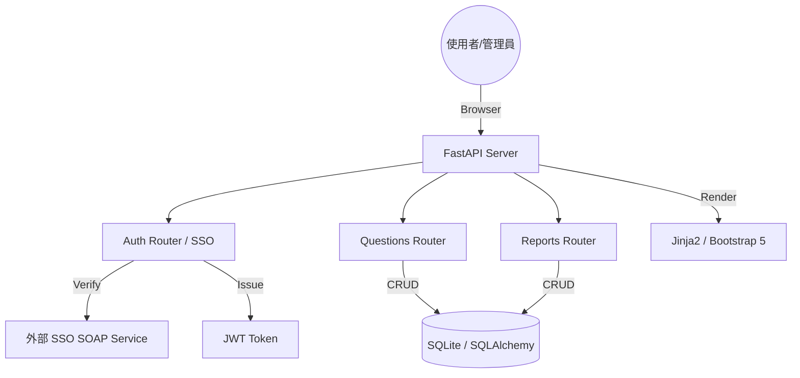
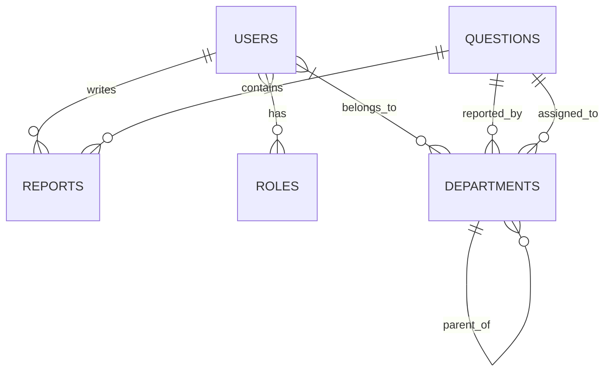

# 問題填報回覆系統 - 設計規格文件 (Design Specification)

## 1. 系統概觀 (System Overview)

本系統為一套為企業內部設計的「問題填報與回覆管理系統」，旨在標準化跨部門問題處理流程，提供透明的進度追蹤與權限管控。

### 核心價值
- **流程標準化**：統一問題填報、回覆、結案的三段式流程。
- **權限精準化**：基於角色 (RBAC) 與部門 (Department-based) 的雙重過濾機制。
- **整合便利性**：支援外部 SSO SOAP 驗證，實現單一登入。

### 技術棧 (Tech Stack)
- **後端框架**：FastAPI (Python)
- **資料庫 ORM**：SQLAlchemy
- **資料庫**：SQLite (預設 `qa_system.db`)
- **驗證機制**：JWT (JSON Web Token) + OAuth2 Password Bearer
- **前端技術**：Jinja2 Templates + Bootstrap 5
- **整合模組**：Zeep (SSO SOAP Client)

---

## 2. 系統架構 (System Architecture)

### 目錄結構
- `app/models/`: 資料庫實體定義。
- `app/routers/`: API 與網頁路由邏輯。
- `app/schemas/`: Pydantic 資料驗證模組。
- `app/dependencies.py`: 依賴注入 (權限檢查、當前用戶獲取)。
- `templates/`: Jinja2 HTML 樣板。
- `static/`: 靜態資源 (CSS, JS)。

### 架構圖

---

## 3. 資料庫設計 (Database Design)

### 實體關係圖 (ERD)

### 主要資料表說明
- **users**: 存儲用戶基本資訊、密碼雜湊、主部門與角色關聯。
- **roles**: 定義權限清單 (JSON 格式 `permissions`)。
- **departments**: 樹狀結構部門表，使用 4 位數代碼 (如 0200 為處，0201 為科)。
- **questions**: 問題核心表，存儲標題、內容、狀態、結案摘要。
- **reports**: 回覆記錄表，關聯問題與回覆者及其所屬部門。
- **多對多關聯表**:
    - `user_role`, `user_department`
    - `question_report_department` (問題填報單位)
    - `question_answer_department` (問題回答單位)

---

## 4. 功能模組說明 (Functional Modules)

### 4.1 驗證與授權
- **SSO 整合**：支援 `getUserProfile` SOAP 介面，自動同步用戶姓名、帳號與單位。
- **RBAC 模式**：角色擁有具體的權限字串（如 `create_question`, `manage_users`）。
- **依賴注入**：使用 `Depends(permission_required("..."))` 攔截未授權請求。

### 4.2 問題處理流程
1. **填報**：使用者選擇「填報部門」與「回答部門」。
2. **回覆**：回答部門的成員可針對問題提交回覆內容。
3. **結案**：具有 `close_question` 權限的人員（通常為填報者或管理員）填寫摘要並將狀態改為 `closed`。

### 4.3 數據過濾邏輯
- 系統會根據當前用戶所屬的 `departments` 列表，自動過濾 `questions` 清單。
- 一般員工只能看到其所屬部門相關（填報或回答）的問題。
- 管理員 (具有 `manage_all` 權限) 則可存取所有數據。

---

## 5. 安全性與擴展 (Security & Scalability)

- **資料庫異質感**：目前使用 SQLite，但透過 SQLAlchemy 的封裝，未來可輕易遷移至 PostgreSQL 或 MySQL。
- **安全性**：
    - 使用 `passlib` (Bcrypt) 進行密碼雜湊。
    - JWT 儲存於 HttpOnly Cookie，防範跨站腳本攻擊 (XSS)。
    - SSO 流程採用 Artifact 跳轉與後端 SOAP 確認，確保身分真實性。
